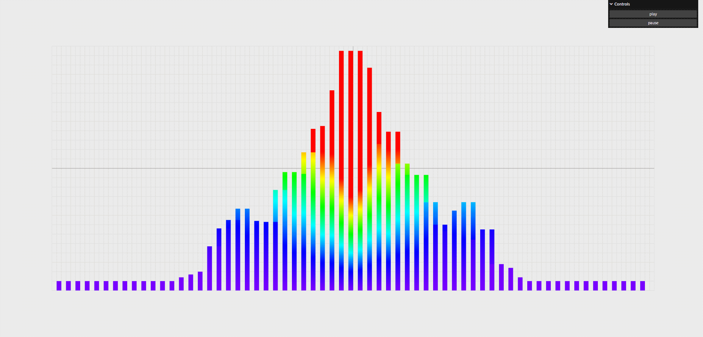
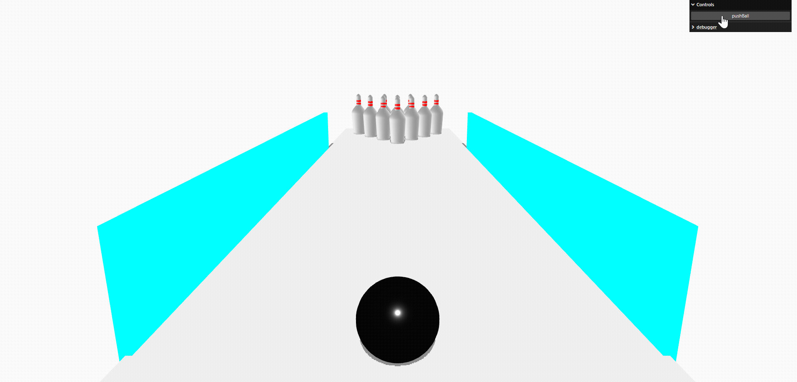
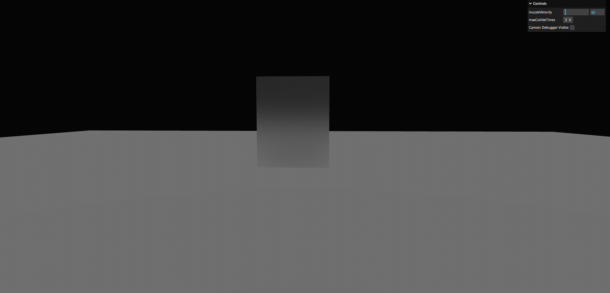
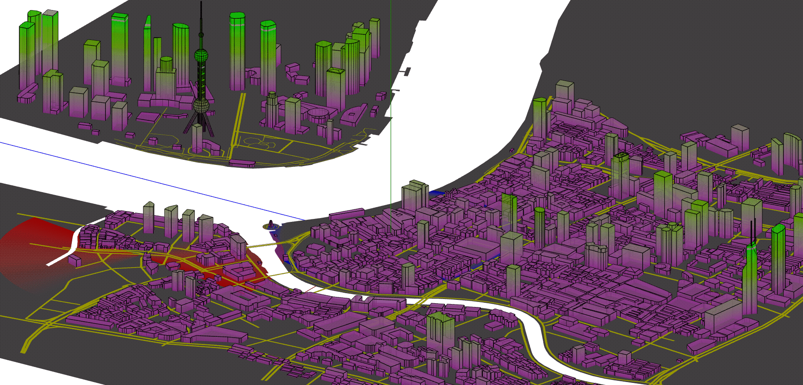
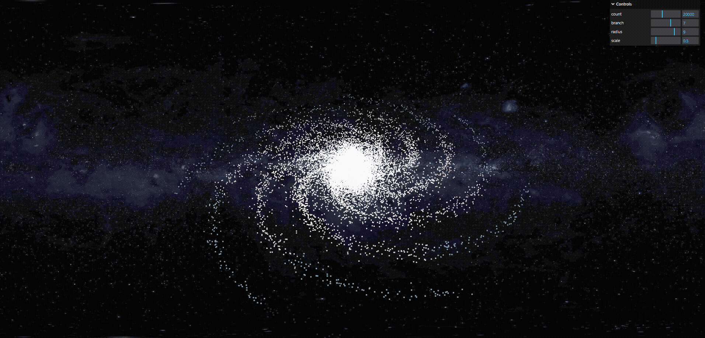
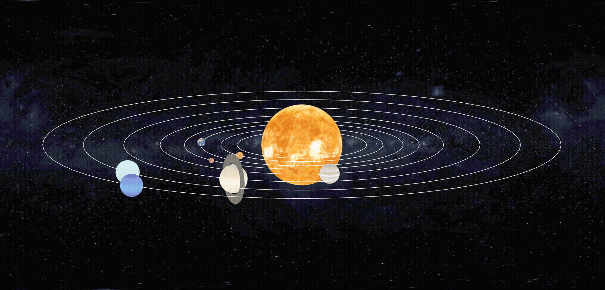
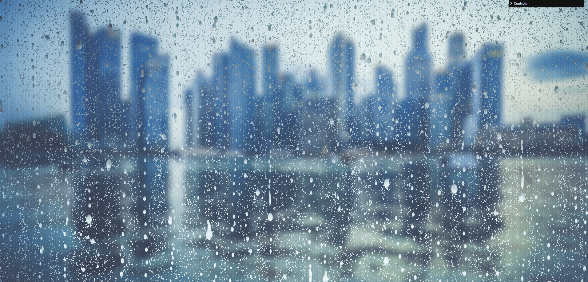
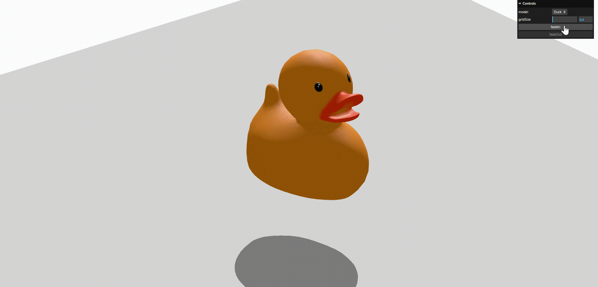
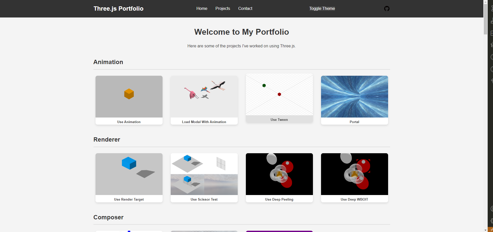

# Three.js Demo Showcase

<p align="center">
  
  
</p>
<p align="center">
  
  
</p>
<p align="center">
  
  
</p>
<p align="center">
  
  
</p>

**👉 [Live Preview](https://avan0203.github.io/threejs-demo/) • [Get Started](#getting-started) • [Add Your Own Case](#adding-new-cases)**

[](https://opensource.org/licenses/MIT)
[](https://threejs.org/)

---

## Introduction

**Three.js Demo** is a dynamic case library built with [Three.js](https://threejs.org/) and modern web technologies. It serves as both a **learning playground** and a **feasibility testbed** for interactive 3D web experiences.

Whether you're exploring shaders, physics simulations, or model interactions — this project has you covered!

### Featured Capabilities

- 📦 **Model Import** (GLTF, OBJ, etc.)  
- 🧊 **Geometry Transformations** (scale, rotate, morph)  
- 📷 **Advanced Camera Controls** (orbit, fly, first-person)  
- 🔍 **Object Picking & Selection**  
- 🎨 **Custom Shader Effects**  
- ⚙️ **Physics Integration** (via Cannon.js or similar)  
- ...and more experimental features!



---

## Getting Started

Clone the repo and spin up the dev server in seconds:

```shell
# Install dependencies (using pnpm)
pnpm install

# Start the development server
pnpm dev

```
Visit http://localhost:6500 (or your configured port) to explore the demos!

---

## Adding New Cases

Want to contribute a new demo? Follow these steps:

1. Register your case in pageList.js:
```javascript
{
  type: 'shaders',
  name: 'My Cool Shader',
  path: '/shaders/my-cool-shader'
}
```

2. Create your demo files under the appropriate directory (e.g., `src/pages/shaders/my-cool-shader/`).
3. Generate a preview screenshot:
```shell
# First time? Install browser for Puppeteer:
npx puppeteer browsers install chrome

# Then generate screenshots
pnpm screenshot
```
4. Preview your work:
```shell
pnpm dev
```
Your new case will appear in the gallery automatically! 🎉

---

## Contribution

We ❤️ contributions! Whether it's:

* A bug fix 🐞
* A new demo idea 💡
* Documentation improvement 📝
* Performance optimization ⚡

Feel free to:

* 📥 Open an Issue
* 🔄 Submit a Pull Request

Let’s build the best Three.js learning resource together!

---

## License

This project is open-source under the MIT License.

See the `LICENSE` file for details.

> Made with ❤️ and WebGL
>
> Powered by Three.js, Vite, and a sprinkle of creativity ✨